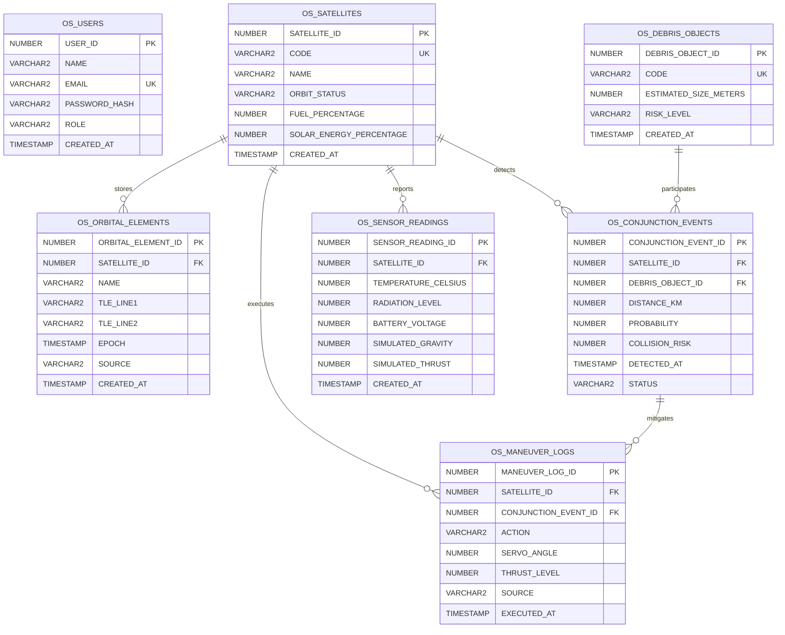

# Orbit Shield ER Diagram

```mermaid
erDiagram
    OS_USERS {
        NUMBER USER_ID PK
        VARCHAR2 NAME
        VARCHAR2 EMAIL UK
        VARCHAR2 PASSWORD_HASH
        VARCHAR2 ROLE
        TIMESTAMP CREATED_AT
    }

    OS_SATELLITES {
        NUMBER SATELLITE_ID PK
        VARCHAR2 CODE UK
        VARCHAR2 NAME
        VARCHAR2 ORBIT_STATUS
        NUMBER FUEL_PERCENTAGE
        NUMBER SOLAR_ENERGY_PERCENTAGE
        TIMESTAMP CREATED_AT
    }

    OS_DEBRIS_OBJECTS {
        NUMBER DEBRIS_OBJECT_ID PK
        VARCHAR2 CODE UK
        NUMBER ESTIMATED_SIZE_METERS
        VARCHAR2 RISK_LEVEL
        TIMESTAMP CREATED_AT
    }

    OS_ORBITAL_ELEMENTS {
        NUMBER ORBITAL_ELEMENT_ID PK
        NUMBER SATELLITE_ID FK
        VARCHAR2 NAME
        VARCHAR2 TLE_LINE1
        VARCHAR2 TLE_LINE2
        TIMESTAMP EPOCH
        VARCHAR2 SOURCE
        TIMESTAMP CREATED_AT
    }

    OS_CONJUNCTION_EVENTS {
        NUMBER CONJUNCTION_EVENT_ID PK
        NUMBER SATELLITE_ID FK
        NUMBER DEBRIS_OBJECT_ID FK
        NUMBER DISTANCE_KM
        NUMBER PROBABILITY
        NUMBER COLLISION_RISK
        TIMESTAMP DETECTED_AT
        VARCHAR2 STATUS
    }

    OS_MANEUVER_LOGS {
        NUMBER MANEUVER_LOG_ID PK
        NUMBER SATELLITE_ID FK
        NUMBER CONJUNCTION_EVENT_ID FK
        VARCHAR2 ACTION
        NUMBER SERVO_ANGLE
        NUMBER THRUST_LEVEL
        VARCHAR2 SOURCE
        TIMESTAMP EXECUTED_AT
    }

    OS_SENSOR_READINGS {
        NUMBER SENSOR_READING_ID PK
        NUMBER SATELLITE_ID FK
        NUMBER TEMPERATURE_CELSIUS
        NUMBER RADIATION_LEVEL
        NUMBER BATTERY_VOLTAGE
        NUMBER SIMULATED_GRAVITY
        NUMBER SIMULATED_THRUST
        TIMESTAMP CREATED_AT
    }

    OS_SATELLITES ||--o{ OS_ORBITAL_ELEMENTS : stores
    OS_SATELLITES ||--o{ OS_CONJUNCTION_EVENTS : detects
    OS_DEBRIS_OBJECTS ||--o{ OS_CONJUNCTION_EVENTS : participates
    OS_SATELLITES ||--o{ OS_MANEUVER_LOGS : executes
    OS_CONJUNCTION_EVENTS ||--o{ OS_MANEUVER_LOGS : mitigates
    OS_SATELLITES ||--o{ OS_SENSOR_READINGS : reports
```
